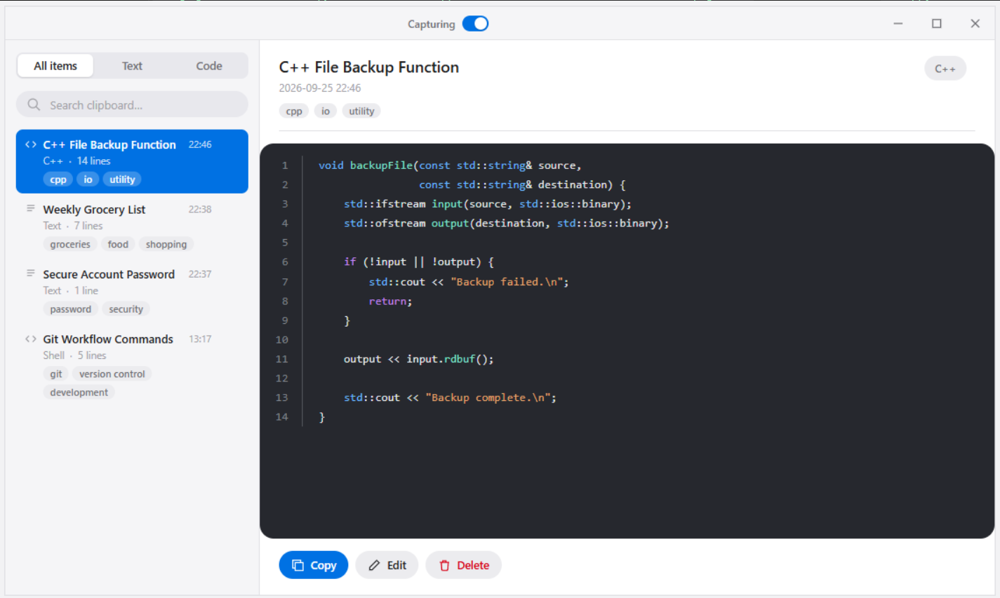

# Clip History

**A clipboard manager for Windows that actually remembers what you copied, and lets you find it again by meaning, not just by scrolling.**

Every copy is captured system-wide, auto-titled, auto-tagged, and embedded for semantic search, so "that config snippet from yesterday" is a search away instead of a re-copy away. The shell is a native Win32 window with a borderless WebView2 UI; the intelligence (titles, tags, embeddings, semantic search) is a small local Python service backed by Google's Gemini.



## Why it exists

The system clipboard holds exactly one thing at a time. The moment you copy something new, whatever you had is gone, so you're constantly re-copying, or pasting into a scratch file "just in case." Clip History sits in the background, keeps a running history of everything you copy, and makes that history searchable by what it *means*, not just by exact text match.

## How it's built

Two processes, one SQLite file:

- **`src/` (C++):** a native Win32 window (custom-drawn, no OS titlebar) hosting a WebView2 browser for the UI. It listens for `WM_CLIPBOARDUPDATE`, pulls the new clipboard text, and hands it to the Python service. It also owns window chrome: drag, resize, minimize/maximize/close are all relayed from the web UI over WebView2's message channel.
- **`ai/` (Python / FastAPI):** the single source of truth for persistence. On every new clip it calls Gemini once to generate a short title and a handful of tags, and calls the embedding model to vectorize the content. `/search` embeds your query and ranks every stored clip by cosine similarity against it.
- **`clips.db` (SQLite):** shared by both sides, resolved relative to each process's own binary/file location so they always agree on the same path regardless of the working directory they're launched from.

### Endpoints (`ai/main.py`)

| Method | Path             | Does |
| ------ | ---------------- | ---- |
| POST   | `/tag`            | Store a new clip; generates title + tags + embedding via Gemini (skips the Gemini calls and just refreshes the timestamp if the content is an exact duplicate) |
| GET    | `/clips`          | List all clips, newest first; used to repopulate the UI on launch |
| PUT    | `/clips/{id}`     | Edit a clip's content in place and refresh its embedding |
| DELETE | `/clips/{id}`     | Remove a clip |
| POST   | `/search`         | Embed the query and rank every stored clip by cosine similarity |

## Features

- **System-wide capture:** hooks the Windows clipboard via `AddClipboardFormatListener`, no polling.
- **Semantic search:** find a clip by describing it, not by remembering its exact wording.
- **Auto title & tags:** every clip gets a short title and 1–3 tags for free, generated once and cached.
- **Pause/resume capture:** a switch in the titlebar stops new clips from being recorded without closing the app.
- **Custom frame:** borderless, dark-themed window with its own drag/resize/min/max/close handling, DPI-aware.
- **Duplicate-safe:** copying the same thing twice updates the timestamp instead of creating a second row, and doesn't re-spend a Gemini call.

## Getting started

### Prerequisites

- Windows 10/11, Visual Studio 2022 (Desktop C++ workload)
- [vcpkg](https://github.com/microsoft/vcpkg) with `webview2` and `sqlite3` installed for `x64-windows`
- Python 3.10+
- A [Gemini API key](https://ai.google.dev/)

### 1. Run the AI service

```bash
cd ai
python -m venv .venv
.venv\Scripts\activate
pip install fastapi uvicorn google-genai python-dotenv

echo GEMINI_API_KEY=your_key_here > .env
uvicorn main:app --reload
```

### 2. Build and run the app

```bash
cmake -B build -S .
cmake --build build --config Debug
build\Debug\MyProject.exe
```

The app talks to the AI service on `localhost`; both resolve `clips.db` to the project root, so a single database is shared between them regardless of where each one was launched from.

## Project layout

```
Clipboard Project/
├── src/
│   ├── main.cpp        # entry point
│   ├── window.cpp/.h    # Win32 window, WebView2 host, clipboard listener
│   ├── database.cpp/.h  # legacy SQLite helpers (persistence now lives in ai/main.py)
│   └── ui/              # index.html / app.js / style.css, served to WebView2 as a virtual host
├── ai/
│   └── main.py           # FastAPI service: tagging, embeddings, search, CRUD
├── CMakeLists.txt
└── clips.db              # shared SQLite database (git-ignored)
```

## Notes

- `clips.db` and `ai/.env` are git-ignored on purpose: the database is local clipboard history (real personal data), and the `.env` holds your API key.
- The C++ side no longer writes clip rows directly; `ai/main.py`'s `/tag` endpoint is the only writer, so every clip has a title, tags, and embedding from the moment it's created.

## License

This project is licensed under the MIT License — see the [LICENSE](LICENSE) file for details.
